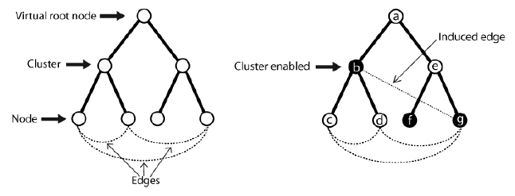

## Advanced Concepts I: Hierarchy structure
### Introduction

GEXF format allows creating hierarchical graph structures e.g. for representing clustering. We model both a tree structure of ancestors and descendents, and a flat graph of nodes bound by edges.



Two ways are available:
* Nodes can simply host other nodes and so on.
* Each node refers to a parent node id via an XML-attribute.

The first style is preferred when the structure written is previously ordered. Sequential reading of this kind of GEXF is safe because no node reference is used. But in the case your program can't provide this, the second way allows writing (and then reading) nodes randomly, but linear reading is at your own risks.

### Sequential-safe Reading
````xml
    <graph mode="static" defaultedgetype="directed">
        <nodes>
          <node id="a" label="Kevin Bacon">
            <nodes>
              <node id="b" label="God">
                <nodes>
                  <node id="c" label="human1"/>
                  <node id="d" label="human2"/>
                </nodes>
              </node>
              <node id="e" label="Me">
                <nodes>
                  <node id="f" label="frog1"/>
                  <node id="g" label="frog2"/>
                </nodes>
              </node>
            </nodes>
          </node>
        </nodes>
        <edges>
            <edge id="0" source="b" target="e" />
            <edge id="1" source="c" target="d" />
            <edge id="2" source="g" target="b" />
            <edge id="3" source="f" target="a" />
        </edges>
    </graph>
````

Note that edges are not necessarily written at the end:

````xml
    <graph mode="static" defaultedgetype="directed">
        <nodes>
          <node id="a" label="Kevin Bacon">
            <nodes>
              <node id="b" label="God">
                <nodes>
                  <node id="c" label="human1"/>
                  <node id="d" label="human2"/>
                </nodes>
                <edges>
                  <edge id="0" source="c" target="d" />
                </edges>
              </node>
              <node id="e" label="Me">
                <nodes>
                  <node id="f" label="frog1"/>
                  <node id="g" label="frog2"/>
                </nodes>
              </node>
            </nodes>
            <edges>
              <edge id="1" source="b" target="e" />
              <edge id="3" source="f" target="a" />
              <edge id="2" source="g" target="b" />
            </edges>
          </node>
        </nodes>
        <edges />
    </graph>
````

### Random Writing
If you can't structure your graph's topology before writing a GEXF file, you may use the second style. Nodes sent to Gephi from a live data source, i.e. a web crawler, are written like this. Note that edges are always written randomly.

````xml
<nodes>
  <node id="a" label="Kevin Bacon" />
  <node id="b" label="God" pid="a" />
  <node id="c" label="human1" pid="b" />
  <node id="d" label="human2" pid="b" />
  <node id="e" label="Me" pid="a" />
  <node id="f" label="frog1" pid="e" />
  <node id="g" label="frog2" pid="e" />
</nodes>
````

With using ````pid````, node order doesn't matter. An implementation should manage the case when a node reference (pid) is used before the node declaration. This listings could also be:

````xml
<nodes>
  <node id="g" label="frog2" pid="e" />
  <node id="a" label="Kevin Bacon" />
  <node id="c" label="human1" pid="b" />
  <node id="b" label="God" pid="a" />
  <node id="e" label="Me" pid="a" />
  <node id="d" label="human2" pid="b" />
  <node id="f" label="frog1" pid="e" />
</nodes>
````

## Advanced Concepts II: Phylogeny structure
Multiple parents can be adressed with the following syntax, where a and b are c's parents:

````xml
<nodes>
  <node id="a" label="cheese">
  <node id="b" label="cherry">
  <node id="c" label="cake">
    <parents>
      <parent for="a" />
      <parent for="b" />
    </parents>
  </node>
</nodes>
````

````
# Extension Point
node-content &=
    element parents { parents-content }?

# New Point
parents-content =
    element parent { parent-content }*

# New Point
parent-content =
    attribute for { id-type }
````

## Advanced Concepts III: Dynamics
As networks dynamics is a growing topic of research, GEXF format includes time support. Enable it by setting the ````mode```` attribute of the ````<graph>```` to "dynamic".
````xml
<graph mode="dynamic">
  ...
</graph>
````
Time in GEXF is encoded in two ways, discrete or continuous.

Discrete, it is an *integer* or a *double*. Continuous, it is encoded as an international standard *date* (yyyy-mm-dd) or a *dateTime* defined by the corresponding [XSD Datatype](http://www.w3.org/TR/xmlschema-2/#dateTime). If omitted, the default type is double. Use the the XML-attribute ````timeformat```` of the graph element to explicitly declare the type.

Example:

````xml
<?xml version="1.1" encoding="UTF-8"?>
<gexf xmlns="http://www.gexf.net/1.3draft"
       xmlns:xsi="http://www.w3.org/2001/XMLSchema-instance"
       xsi:schemaLocation="http://www.gexf.net/1.3draft
                             http://www.gexf.net/1.3draft/gexf.xsd"
      version="1.3">
  <meta lastmodifieddate="2009-03-20">
    <creator>Gephi.org</creator>
    <description>A Web network changing over time</description>
  </meta>
  <graph mode="dynamic" defaultedgetype="directed" timeformat="date"
         start="2009-01-01" end="2009-03-20">
    <attributes class="node" mode="static">
      <attribute id="0" title="url" type="string"/>
      <attribute id="1" title="frog" type="boolean">
        <default>true</default>
      </attribute>
    </attributes>
    <attributes class="node" mode="dynamic">
      <attribute id="2" title="indegree" type="float"/>
    </attributes>
    <nodes>
      <node id="0" label="Gephi" start="2009-03-01">
        <attvalues>
          <attvalue for="0" value="http://gephi.org"/>
          <attvalue for="2" value="1"/>
        </attvalues>
      </node>
      <node id="1" label="Webatlas">
        <attvalues>
          <attvalue for="0" value="http://webatlas.fr"/>
          <attvalue for="2" value="1" end="2009-03-01"/>
          <attvalue for="2" value="2" start="2009-03-01" end="2009-03-10"/>
          <attvalue for="2" value="1" start="2009-03-11"/>
        </attvalues>
      </node>
      <node id="2" label="RTGI" end="2009-03-10">
        <attvalues>
          <attvalue for="0" value="http://rtgi.fr"/>
          <attvalue for="2" value="0" end="2009-03-01"/>
          <attvalue for="2" value="1" start="2009-03-01"/>
        </attvalues>
      </node>
      <node id="3" label="BarabasiLab">
        <attvalues>
          <attvalue for="0" value="http://barabasilab.com"/>
          <attvalue for="1" value="false"/>
          <attvalue for="2" value="0" end="2009-03-01"/>
          <attvalue for="2" value="1" start="2009-03-01"/>
        </attvalues>
      </node>
    </nodes>
    <edges>
      <edge id="0" source="0" target="1" start="2009-03-01"/>
      <edge id="1" source="0" target="2"
             start="2009-03-01" end="2009-03-10"/>
      <edge id="2" source="1" target="0" start="2009-03-01"/>
      <edge id="3" source="2" target="1" end="2009-03-10"/>
      <edge id="4" source="0" target="3" start="2009-03-01"/>
    </edges>
  </graph>
</gexf>
````

### Dynamic Topology
Time limits declared for a graph element are optional, however they could save pre-importing computation. Time limits of edges must be consistent with the related nodes'ones.

The graph scope is defined as follow for a network from 2009-01-01 to 2009-03-20:
````xml
<graph mode="dynamic" start="2009-01-01" end="2009-03-20">
````

Each edge must declare time limits inside the join scope of ````source```` and ````target````:
* edge.start < (source.start and target.start)
* edge.end   > (source.end   and target.end)

````xml
<nodes>
  <node id="0" label="Hello" start="2009-01-01" end="2009-02-01" />
  <node id="1" label="World" start="2009-01-15" end="2009-03-20" />
  ...
</nodes>
<edges>
  <edge id="0" source="0" target="1" start="2009-01-20" end="2009-02-01"/>
</edges>
````
*Important:*
````start```` and ````end```` values are inclusive, i.e. the following line is allowed:

````xml
<edge id="0" source="0" target="1" start="2009-01-20" end="2009-01-20"/>
````
And of course the ````end```` value must be later than the ````start```` value. 

If a node or an edge exists only at some timeranges, we use the concept of spells. Spells are not provided for data values, which are only limited by one ````start```` and one ````end````. Use the xml-element ````<spells>```` for topology like this:

````xml
<gexf ...>
  ...
  <graph mode="dynamic" timeformat="date">
    <node id="0" label="Hello">
      <spells>
        <spell start="2009-01-01" end="2009-01-15" />
        <spell start="2009-01-30" end="2009-02-01" />
      </spells>
    </node>
    ...
  </graph>
</gexf>
````

If the xml-attributes ````start```` and ````end```` are used in node like before, they should be ignored by parsers: if spells are provided, only their content are taken into account. If no ````start```` is provided, the spell begins with the network. If no ````end```` is provided, the spell ends with the network. If two spells are covering a same period of time, parsers should consider them as a unique spell.

````
# Extension Point
graph-content &=
    attribute timeformat { timeformat-type }?
  & (
      ( attribute start { time-type }?)
      &
      ( attribute end { time-type }?)
  )

# Extension Point
node-content &= (
      ( attribute start { time-type }?)
      &
      ( attribute end { time-type }?)
  )
  & element spells { spells-content }?

# Extension Point
edge-content &= (
      ( attribute start { time-type }?)
      &
      ( attribute end { time-type }?)
  )
  & element spells { spells-content }?
````

##### About the weight: 
dynamic weight can be used with the reserved title ````weight```` in ````<attributes>````. In dynamic mode, the static XML-attribute ````weight```` should be ignored if the dynamic one is provided.
	
### Dynamic Data
Node and edges data can take different values over time. Attributes must be declared as dynamic, allowing values to exist in during a time scope.

#### Declaring Dynamic Attributes
````xml
<gexf ...>
  ...
  <graph mode="dynamic" defaultedgetype="directed">
    <attributes class="node" mode="dynamic">
      <attribute id="2" title="indegree" type="float"/>
      ...
    </attributes>
    ...
  </graph>
</gexf>
````

````
# Extension Point
attributes-content &= (
      ( attribute start { time-type }?)
      &
      ( attribute end { time-type }?)
  )
````

#### Defining Dynamic Values
Attvalues have their scopes limited by the xml-attributes ````start```` and ````end````.

````xml
<node id="3" label="BarabasiLab">
  <attvalues>
    <attvalue for="2" value="0" start="2009-01-01" end="2009-03-01"/>
    <attvalue for="2" value="1" start="2009-03-02" end="2009-03-10"/>
  </attvalues>
</node>
````

````
# Extension Point
attributes-content &= (
      ( attribute start { time-type }?)
      &
      ( attribute end { time-type }?)
  )
````

#### Dynamic Values and Spells
If an ''''<attvalue>'''' is covering a period out of any spell, this period should be ignored by parsers. In the following example, the day 2009-01-03 is ignored:
	
````xml
<gexf ...>
  ...
  <graph mode="dynamic">
    <node id="0" label="Hello">
      <attvalues>
        <attvalue for="0" value="1" start="2009-01-01" end="2009-01-05"/>
      </attvalues>
      <spells>
        <spell start="2009-01-01" end="2009-01-02" />
        <spell start="2009-01-04" end="2009-01-05" />
      </spells>
    </node>
    ...
  </graph>
</gexf>
````

If a value 'B' is declared after a value 'A' of the same attribute and overlaps it, then 'A' is forced to end at 'B' start. In the following example, 'A' will effectively end at 2009-03-03, and the value at 2009-03-03 is 'B':

````xml
<node id="0" label="Hello">
  <attvalues>
    <attvalue for="0" value="A" start="2009-03-01" end="2009-03-05"/>
    <attvalue for="0" value="B" start="2009-03-03" end="2009-03-10"/>
  </attvalues>
</node>
````

One of the consequences of this rule is the right to end 'A' exactly with the 'B' start. Attribute '0' takes then the value 'B' at 2009-03-01.

````xml
<node id="0" label="Hello">
  <attvalues>
    <attvalue for="0" value="A" end="2009-03-01"/>
    <attvalue for="0" value="B" start="2009-03-01"/>
  </attvalues>
</node>
````

While each data value is encoded in one piece of time, spells can cut them into more pieces. In the following example, a node exists from the beginning of the graph to 2009-03-01, and re-appears from 2009-03-05 to 2009-03-10. The data values will then fit inside these scopes even if they initially have a larger scope. Value 'A' of attribute '2' will be effective in 2009-03-01 (dates are inclusive), and from 2009-03-05 to 2009-03-10.

````xml
<node id="2" label="RTGI">
  <attvalues>
    <attvalue for="0" value="http://rtgi.fr"/>
    <attvalue for="2" value="X" end="2009-02-28"/>
    <attvalue for="2" value="A" start="2009-03-01"/>
  </attvalues>
  <spells>
    <spell end="2009-03-01">
    <spell start="2009-03-05" end="2009-03-10">
  </spells>
</node>
````

````
# New Point
spells-content =
    element spell { spell-content }+

# New Point
spell-content = (
      ( attribute start { time-type }?)
      &
      ( attribute end { time-type }?)
  )
````

## Advanced Concepts IV: Extending GEXF
GEXF is designed to be easily extensible. Additional namespaces are defined by an XML Schema. The default namespace is always the gexf namespace. Gephi team actually provides a module for storing visualization data called *viz*.

### VIZ module
Using the visualization module must be declared by adding the XML-Attribute ````xmlns:viz="http://www.gexf.net/1.3draft/viz"```` to the document namespaces. The ````xsi:schemaLocation```` attribute includes the XML-Schema declaration of the VIZ module. The RelaxNG Compact specification is available in [viz.rnc](http://www.gexf.net/1.3draft/viz.rnc), and independent XSD declaration in [viz.xsd](http://www.gexf.net/1.3draft/viz.xsd).

Color, position, size and shape are stored as attributes.

These elements are compatible with spells and intervals defined in previous section.

#### Node Example
The following gexf contains a node having a color, a position, a shape and a specified size.

````xml
<gexf xmlns="http://www.gexf.net/1.3draft"
      xmlns:viz="http://www.gexf.net/1.3draft/viz">
...
  <node ... >
    <viz:color r="239" g="173" b="66" a="0.5"/>
    <viz:position x="15.783598" y="40.109245" z="0.0"/>
    <viz:size value="2.0375757"/>
    <viz:shape value="disc"/>
  </node>
...
</gexf>
````

#### Edge Example
The following gexf contains an edge having a color, a thickness and a shape.
````xml
<gexf xmlns="http://www.gexf.net/1.3draft"
      xmlns:viz="http://www.gexf.net/1.3draft/viz">
...
  <edge ... >
    <viz:color r="157" g="213" b="78"/>
    <viz:thickness value="5.124"/>
    <viz:shape value="solid"/>
  </edge>
...
</gexf>
````

#### Colors
Colors are either defined by the [RGBA color model](http://en.wikipedia.org/wiki/RGBA) or by an html-like hex syntax. Each XML-attribute value ````r````, ````g```` or ````b```` is hence an integer from 0 to 255. Alternatively color can be defined as hex value ````hex```` with or without the initial "#" symbol.  In both cases an optional alpha value ````a```` as a float from 0.0 to 1.0 can be added.

````xml
<viz:color r="239" g="173" b="66" a="0.5"/>
````

````xml
<viz:color hex="FF38AG" a="0.5"/>
````

````
# Extension Point
node-content &=
    element color { color-content }?

# New Point
color-content =
    attribute r { color-channel }
  & attribute g { color-channel }
  & attribute b { color-channel }
  & attribute a { alpha-channel }?

# Datatypes

color-channel =
    xsd:nonNegativeInteger { maxInclusive = "255" }

alpha-channel = [ a:defaultValue = "1.0" ]
    xsd:float { minInclusive = "0.0" maxInclusive = "1.0" }
````

#### Position
Space positions are set in three dimensions called ````x````, ````y```` and ````z````. Note that Gephi associates ````z```` as the height, and most of spatialization algorithms only use ````x```` and ````y````. They are floats.

````xml
<viz:position x="15.783598" y="40.109245" z="0.0"/>
````

````
# Extension Point
node-content &=
  element position { position-content }?

# New Point
position-content =
    attribute x { space-point }
  & attribute y { space-point }
  & attribute z { space-point }

# Datatype
space-point =
    xsd:float
````

#### Size
Node size is a scale. It is set to *1.0* by default and is a non-negative float. Network viz softwares assume that an object representing a node of size "2.0" is twice bigger as one of "1.0".

````xml
<viz:size value="2.0375757"/>
````

````
# Extension Point
node-content &=
  element size { size-content }?

# New Point
size-content =
    attribute value { size-type }

# Datatype
size-type = [ a:defaultValue = "1.0" ]
    xsd:float { minInclusive = "0.0"}
````

#### Thickness
Edge thickness is a scale. It is set to *1.0* by default and is a non-negative float. Network viz softwares assume that an object representing an edge of thickness "2.0" is twice bigger as one of "1.0".

````xml
<viz:size value="2.0375757"/>
````

````
# Extension Point
edge-content &=
  element thickness { thickness-content }?

# New Point
thickness-content =
    attribute value { thickness-type }

# Datatype
thickness-type = [ a:defaultValue = "1.0" ]
    xsd:float { minInclusive = "0.0"}
````

#### Node Shape
The default shape of nodes is a disc. Four shapes are proposed: ````disc````, ````square````, ````triangle```` and ````diamond````. Images require an additional XML-Attribute to set their location: ````uri````.

````xml
<viz:shape value="image" uri="http://my.image.us/blah.jpg"/>
````

````
# Extension Point
node-content &=
  element shape { node-shape-content }?

# New Point
node-shape-content =
    attribute value { node-shape-type }
   & attribute uri { xsd:anyURI }?

# Datatype
node-shape-type =  [ a:defaultValue = "disc" ]
    string "disc" |
    string "square" |
    string "triangle" |
    string "diamond" |
    string "image"
````

#### Edge Shape
The default shape of edges is solid. Four shapes are proposed: ````solid````, ````dotted````, ````dashed```` and ````double````.

````xml

````
<viz:shape value="dotted"/>
````
# Extension Point
edge-content &=
  element shape { edge-shape-content }?

# New Point
edge-shape-content =
    attribute value { edge-shape-type }

# Datatype
edge-shape-type =  [ a:defaultValue = "solid" ]
    string "solid" |
    string "dotted" |
    string "dashed" |
    string "double"
````

## Advices: Parser optimization
This section provides some good tips to write parser-friendly files.
* Always place the edges after the nodes. This is mandatory since version 1.2. Some parsers, depending on their implementation, may reject an edge if its linked nodes haven't been declared before, due to conceptual or data integrity reason.
* Use the ````count```` XML-attribute in ````<nodes>```` and ````<edges>```` declaration: the parser will know how much memory it should allocate, and will speed up the file reading. Note that count only refers to direct children, not the whole sub-graph!
* Prefer ````liststring```` to ````string```` attributes if you can. A smart parser will store the strings in one place, and just set pointers to them from the related nodes/edges.
* Identifiers may be interpreted as integers if you only use numbers. We encourage this practice, as an integer takes much less size in memory than an equivalent string. Tell the parser to optimize IDs storage by filling the optional graph XML-attribute called ````idtype```` with ````string```` or ````integer````.
 
## Web Services
The content-type for serving GEXF files via HTTP/REST is ````application/gexf+xml````.
 
 
